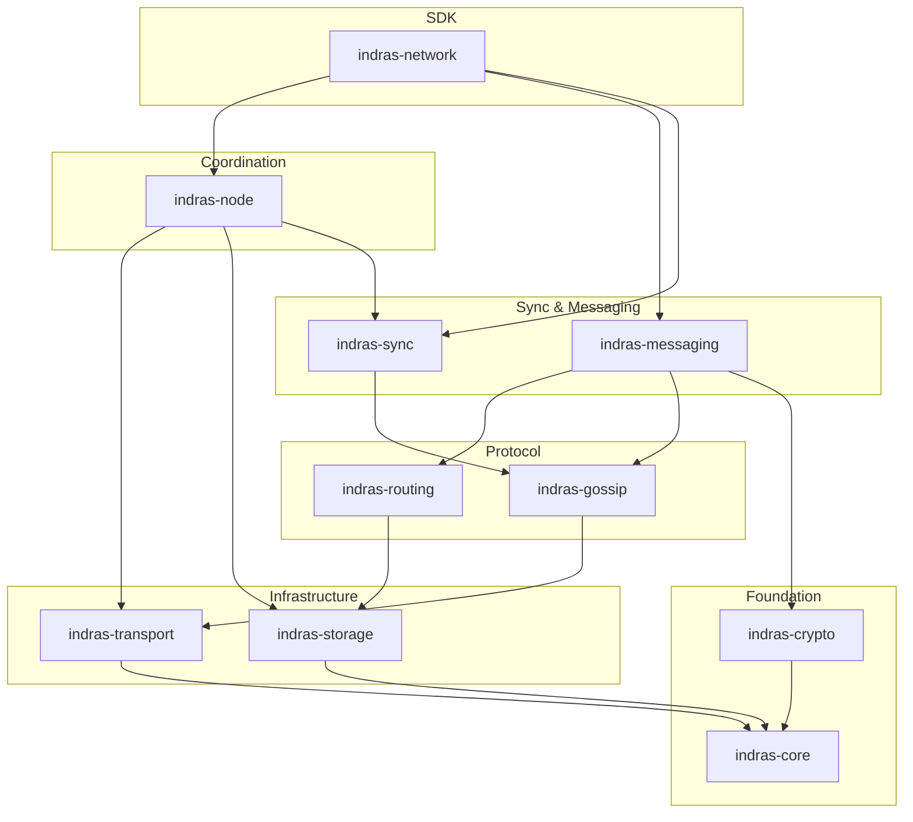
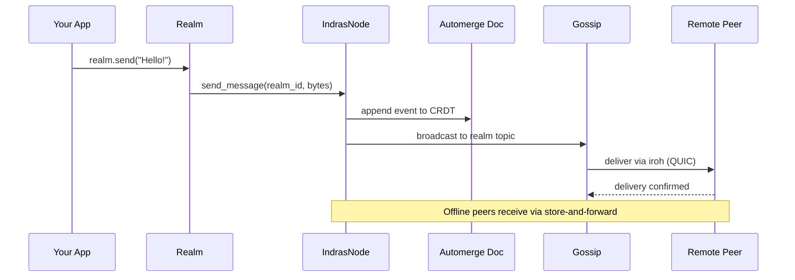
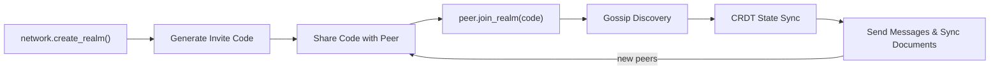

# Indra's Network

Energy cannot be created or destroyed — only moved from one place to another. Attention works the same way. You can only focus on one thing at a time. Shift your focus to something new, and the old thing loses exactly what the new thing gains. The total never changes.

This project takes that observation seriously. Indra's Network is a peer-to-peer SDK that enforces a conservation law on human attention — the same kind of law that governs energy in physics. No blockchain, no global consensus. Just local peers witnessing each other's state transitions, and a mathematical guarantee that nothing is created from thin air.

We're building this in the open as a research project — 25+ Rust crates, actively evolving, and available for collaboration.

**[The Conservation of Attention — Whitepaper](articles/WhitePaper.md)**

## What Makes This Different

- **Conservation over consensus.** The attention ledger enforces a conservation law — attention mass can move between intentions but the total never changes. Safety comes from local antisymmetric transitions, not global ordering. No blockchain required.
- **Local trust over global ledger.** Peers witness each other's state transitions directly. Liveness depends on your local quorum, not the whole network. Byzantine faults are contained to the peers who made them.
- **Sovereignty by default.** Your Home Realm is your persistent identity container — it travels with you. Your Pass Story is your authentication. Post-quantum cryptography protects everything. No platform owns your data.
- **Active research, open for collaboration.** This is a working codebase, not a finished product. We're exploring how conservation laws, CRDTs, and local trust compose into something new. Contributions and conversations welcome.

## How It Works

The SDK provides the substrate the attention ledger builds on:

- **Realms** — Isolated peer groups for collaboration, chat, or shared workspaces
- **Messaging** — Direct peer messaging with delivery confirmation and offline queuing
- **CRDT Documents** — Synchronized shared state across peers using Automerge
- **Attention Ledger** — Hash-chained switch-events, witness certificates, quorum-based verification, and a gratitude bridge that converts sustained focus into transferable value
- **Post-quantum crypto** — Hybrid Ed25519 + ML-DSA-65 signatures, ML-KEM-768 key exchange
- **Store-and-forward routing** — Delay-tolerant networking for offline and mobile scenarios
- **Artifact sharing** — Blob storage and sync with access control and deduplication

See the [Developer's Guide](articles/indras-network-developers-guide.md) for complete API documentation.

## Quick Start

### Installation

Add to your `Cargo.toml`:

```toml
[dependencies]
indras-network = "1.0"
tokio = { version = "1", features = ["full"] }
```

### The Simplest Thing That Works

```rust
use indras_network::prelude::*;

#[tokio::main]
async fn main() -> Result<()> {
    // Create a network instance with default configuration
    let network = IndrasNetwork::new("~/.myapp").await?;

    // Create a realm for collaboration
    let realm = network.create_realm("My Project").await?;

    // Get an invite code to share with peers
    println!("Invite: {}", realm.invite_code().unwrap());

    // Send a message
    realm.send("Hello, world!").await?;

    Ok(())
}
```

`IndrasNetwork::new()` handles everything: generates your cryptographic identity, sets up local storage, starts the networking stack, connects to relay servers, and begins peer discovery.

## Architecture



| Crate | Purpose |
|-------|---------|
| `indras-network` | Main SDK entry point — the single import for applications |
| `indras-core` | Core types and traits (`MemberId`, `RealmId`, events) |
| `indras-node` | P2P node lifecycle and interface management |
| `indras-crypto` | Cryptographic primitives (Ed25519, ML-DSA-65, ML-KEM-768, Argon2id) |
| `indras-transport` | Network transport layer (built on iroh) |
| `indras-routing` | Peer routing and relay logic |
| `indras-storage` | Persistent storage layer |
| `indras-gossip` | Gossip protocols for peer discovery |
| `indras-sync` | CRDT sync primitives (ArtifactDocument, HeadTracker, RawSync) |
| `indras-sync-engine` | Higher-level sync engine |
| `indras-messaging` | Message routing and chat infrastructure |
| `indras-artifacts` | Domain model (Vault, Story, Intention, attention economy) |
| `indras-dtn` | Delay-tolerant networking for offline scenarios |
| `indras-iot` | IoT device networking |
| `indras-logging` | Structured logging |

**Applications:** `indras-dashboard`, `indras-chat`, `indras-home-viewer`, `indras-realm-viewer`, `indras-collaboration-viewer`, `indras-ui`, `indras-genesis`, `indras-workspace`

**Examples:** `chat-app`, `sync-demo`, `indras-notes`

### How Messages Flow



### Realm Lifecycle



## Articles & Whitepaper

**[The Conservation of Attention](articles/WhitePaper.md)** — The whitepaper: what happens when you enforce conservation laws on human attention instead of cryptocurrency

- **[The Attention Ledger (general audience)](articles/attention_ledger_general_audience_article.md)** — A non-technical introduction to the attention ledger
- **[Formal Whitepaper](articles/locally_conservative_attention_ledger_whitepaper.md)** — Academic treatment with proofs: safety, liveness, and Byzantine fault tolerance
- **[Implementation Guide](articles/iroh_implementation_guide_locally_conservative_attention_ledger.md)** — Mapping the attention ledger onto iroh and Indra's Network
- **[Two Paths to Decentralization](articles/two-paths-to-decentralization.md)** — Why Indra's Network chose a different road than Logos
- **[Shared Roots, Different Branches](articles/shared-roots-different-branches.md)** — How Indra's Network and Anytype diverge from common ground
- **[Every Node a Mirror](articles/indras-network-every-node-a-mirror.md)** — Building the internet that an ancient philosophy imagined
- **[Your Story Is Your Key](articles/your-story-is-your-key.md)** — How a hero's journey becomes unbreakable authentication
- **[Your Files Live With You](articles/your-files-live-with-you.md)** — How a peer-to-peer filesystem turns sharing into a spectrum of trust
- **[Nobody Owns the Conversation](articles/nobody-owns-the-conversation.md)** — How single stewardship and fractal composition solve the problem that group ownership never could
- **[The Heartbeat of Community](articles/the-heartbeat-of-community.md)** — How subjective value, trust chains, and proof of life turn tokens into letters of introduction
- **[Your Network Has an Immune System](articles/your-network-has-an-immune-system.md)** — How decentralized sentiment turns a communication mesh into a living, self-protecting organism

## Documentation

- **[Developer's Guide](articles/indras-network-developers-guide.md)** — Complete API reference, configuration, realms, messaging, documents, artifacts, peering
- **[AGENTS.md](./AGENTS.md)** — Architecture documentation for each crate
- **Examples** — See `examples/` directory for chat apps, sync demos, and note-taking applications
