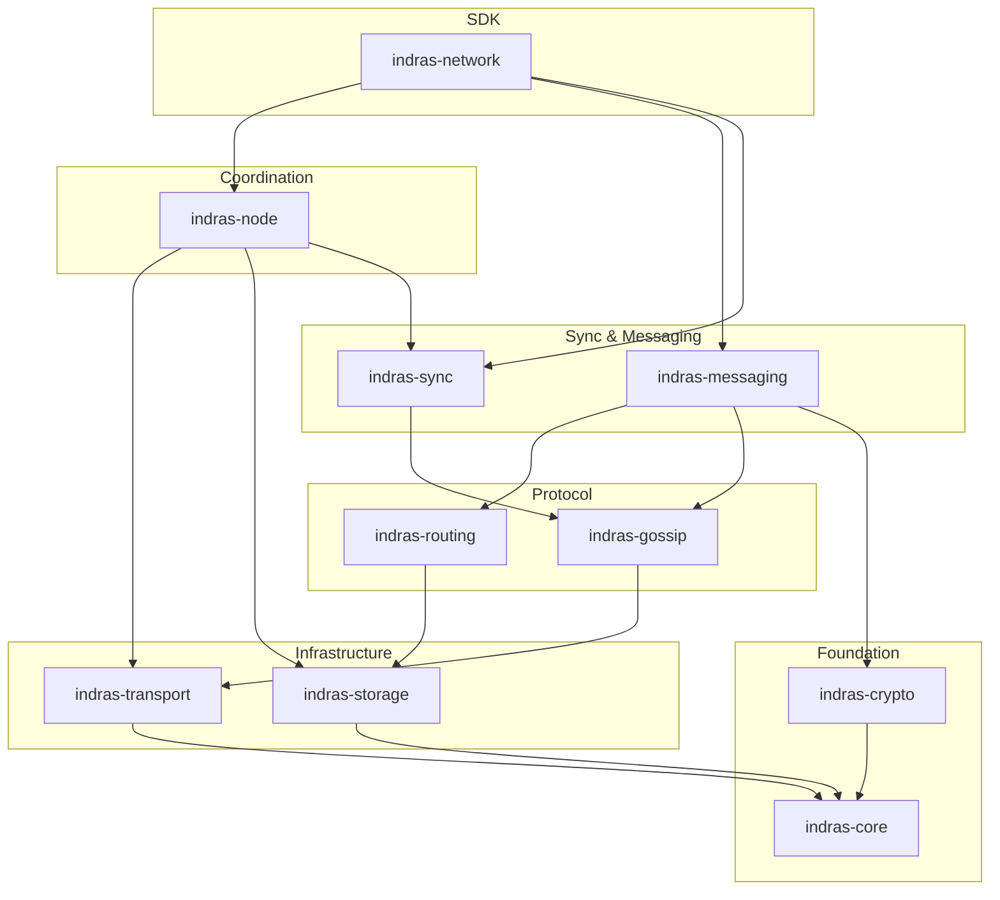
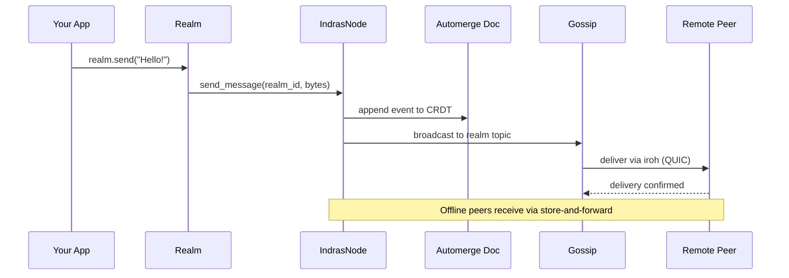
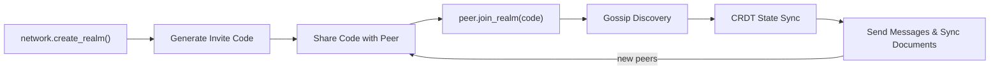

# Indra's Network

[](https://github.com/truman/IndrasNetwork/actions/workflows/ci.yml)

A fully-featured peer-to-peer networking SDK for building decentralized applications with end-to-end encryption, CRDT document sync, artifact sharing, and intelligent routing.

## Overview

Indra's Network is a production-ready Rust SDK for building peer-to-peer applications. Built on top of [iroh](https://iroh.computer), it provides a high-level abstraction for distributed networking with support for:

- **Realms**: Isolated peer groups for collaborative spaces, chat rooms, or shared workspaces
- **Messaging**: Direct peer messaging with read tracking and delivery confirmation
- **CRDT Documents**: Synchronized shared state across all peers in a realm using Automerge
- **Artifact Sharing**: Efficient blob storage and sync with access control
- **Identity System**: Cryptographic identity with post-quantum crypto support
- **Peering & Sentiment**: Strategic peer selection and reputation tracking
- **Encounters**: Temporary direct connections for offline/mobile scenarios
- **Home Realm**: Persistent identity container that travels with you

See the [Developer's Guide](/articles/indras-network-developers-guide.md) for complete documentation.

## Key Features

- **Realms & Presence**: Create isolated collaboration spaces with automatic member discovery and presence tracking
- **Real-time Messaging**: Send and receive messages with automatic offline queuing and delivery confirmation
- **Document Sync**: Build collaborative apps with CRDT-based document synchronization (powered by Automerge)
- **Artifact Storage**: Share files, blobs, and large data structures with peer-to-peer sync and deduplication
- **Post-Quantum Crypto**: Prepare for quantum-resistant encryption with hybrid post-quantum support
- **Access Control**: Fine-grained permissions for realms, documents, and artifacts
- **Offline-First**: Works reliably even when peers go offline; automatic reconnection and message queuing
- **Smart Routing**: Encounters for temporary direct connections, intelligent peer selection via sentiment scoring
- **Configuration Presets**: Pre-tuned profiles for Chat, Collaboration, IoT, and OfflineFirst use cases

## Quick Start

### Installation

Add to your `Cargo.toml`:

```toml
[dependencies]
indras-network = "1.0"
tokio = { version = "1", features = ["full"] }
```

### The Simplest Thing That Works

```rust
use indras_network::prelude::*;

#[tokio::main]
async fn main() -> Result<()> {
    // Create a network instance with default configuration
    let network = IndrasNetwork::new("~/.myapp").await?;

    // Create a realm for collaboration
    let realm = network.create_realm("My Project").await?;

    // Get an invite code to share with peers
    println!("Invite: {}", realm.invite_code().unwrap());

    // Send a message
    realm.send("Hello, world!").await?;

    Ok(())
}
```

`IndrasNetwork::new()` handles everything: generates your cryptographic identity, sets up local storage, starts the networking stack, connects to relay servers, and begins peer discovery.

## Configuration & Presets

Choose a preset tailored to your use case:

| Preset | Max Peers | Max Realms | Best For |
|--------|-----------|-----------|----------|
| `Default` | 64 | 32 | General-purpose applications |
| `Chat` | 128 | 64 | Messaging and social apps |
| `Collaboration` | 32 | 16 | Document editing and real-time sync |
| `IoT` | 8 | 4 | IoT device networks |
| `OfflineFirst` | 64 | 32 | Offline-heavy mobile applications |

```rust
let network = IndrasNetwork::preset(Preset::Chat)
    .data_dir("~/.myapp")
    .build()
    .await?;
```

## Architecture



Indra's Network is organized as a Rust workspace with specialized crates:

| Crate | Purpose |
|-------|---------|
| `indras-network` | Main SDK entry point — the single import for applications |
| `indras-core` | Core types and traits (`MemberId`, `RealmId`, events) |
| `indras-node` | P2P node lifecycle and interface management |
| `indras-crypto` | Cryptographic primitives (Ed25519, ML-DSA-65, ML-KEM-768, Argon2id) |
| `indras-transport` | Network transport layer (built on iroh) |
| `indras-routing` | Peer routing and relay logic |
| `indras-storage` | Persistent storage layer |
| `indras-gossip` | Gossip protocols for peer discovery |
| `indras-sync` | CRDT sync primitives (ArtifactDocument, HeadTracker, RawSync) |
| `indras-sync-engine` | Higher-level sync engine |
| `indras-messaging` | Message routing and chat infrastructure |
| `indras-artifacts` | Domain model (Vault, Story, Intention, attention economy) |
| `indras-dtn` | Delay-tolerant networking for offline scenarios |
| `indras-iot` | IoT device networking |
| `indras-logging` | Structured logging |

**Applications:** `indras-dashboard`, `indras-chat`, `indras-home-viewer`, `indras-realm-viewer`, `indras-collaboration-viewer`, `indras-ui`, `indras-genesis`, `indras-workspace`

**Examples:** `chat-app`, `sync-demo`, `indras-notes`

### How Messages Flow



### Realm Lifecycle



## Common Use Cases

### Building a Chat App

```rust
use indras_network::prelude::*;

let network = IndrasNetwork::preset(Preset::Chat)
    .data_dir("~/.chat_app")
    .display_name("A")
    .build()
    .await?;

network.start().await?;

let realm = network.create_realm("General").await?;
realm.send("Hey everyone!").await?;

// Listen for incoming messages
let mut messages = realm.messages();
while let Some(msg) = messages.next().await {
    println!("{}: {}", msg.sender_name, msg.content.as_text().unwrap_or(""));
}
```

### Collaborative Documents

```rust
use indras_network::prelude::*;

let realm = network.create_realm("Team Project").await?;
let doc: Document<TodoList> = realm.document("todos").await?;

// Updates sync automatically across all peers
doc.update(|todos| {
    todos.items.push(TodoItem { text: "Ship v2".into(), done: false });
}).await?;

// React to remote changes
let mut changes = doc.changes();
while let Some(change) = changes.next().await {
    println!("Updated (remote={}): {:?}", change.is_remote, change.new_state);
}
```

### Direct Connect

```rust
// Knowing someone's identity code is enough to connect
let (realm, peer_info) = network.connect_by_code("indra1qyz...k3m").await?;
realm.send("Hello!").await?;
```

## Documentation

- **[Developer's Guide](/articles/indras-network-developers-guide.md)** — Complete API reference, configuration, realms, messaging, documents, artifacts, peering, and more
- **[AGENTS.md](./AGENTS.md)** — Architecture documentation for each crate
- **Examples** — See `examples/` directory for chat apps, sync demos, and note-taking applications

### Articles

- **[Every Node a Mirror](/articles/indras-network-every-node-a-mirror.md)** — Building the internet that an ancient philosophy imagined
- **[Your Story Is Your Key](/articles/your-story-is-your-key.md)** — How a hero's journey becomes unbreakable authentication
- **[Your Files Live With You](/articles/your-files-live-with-you.md)** — How a peer-to-peer filesystem turns sharing into a spectrum of trust
- **[Nobody Owns the Conversation](/articles/nobody-owns-the-conversation.md)** — How single stewardship and fractal composition solve the problem that group ownership never could
- **[The Heartbeat of Community](/articles/the-heartbeat-of-community.md)** — How subjective value, trust chains, and proof of life turn tokens into letters of introduction
- **[Your Network Has an Immune System](/articles/your-network-has-an-immune-system.md)** — How decentralized sentiment turns a communication mesh into a living, self-protecting organism

## License

MIT OR Apache-2.0
