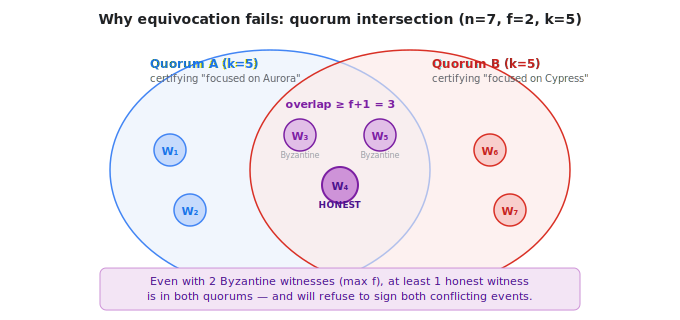
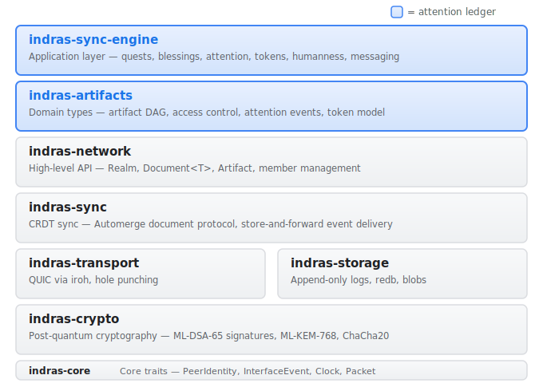
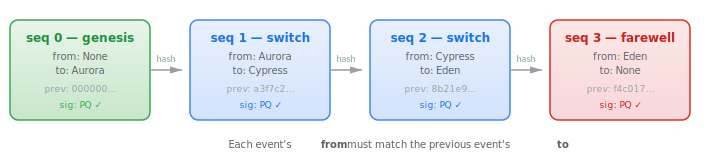
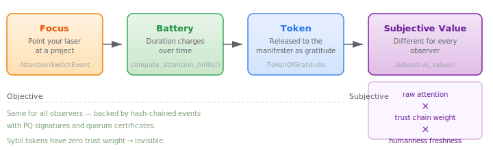

# The Locally-Conservative Attention Ledger

*A conservation-law approach to tracking collective cognitive focus without global consensus*

## The Problem

Every distributed ledger built so far tracks the same thing: money. Bitcoin, Ethereum, and their descendants all solve the same puzzle: how do you get thousands of computers around the world to agree on who owns what? Their answer is *global consensus* — every computer processes every transaction, and they all vote on a single shared history. That works, but it's slow and expensive, because every machine must do all the work.

But money is not the only scarce resource worth tracking.

Attention is scarce. You can only focus on one thing at a time. Right now, you're reading this article — which means you're *not* reading anything else. Unlike money, attention cannot be counterfeited, stockpiled, or inflated. It moves — from one thing to another — and the total never changes. That conservation is not a design choice. It is a physical constraint of human cognition.

The attention ledger tracks this resource. Not with a blockchain. Not with global consensus. With a conservation law — a mathematical rule that says the total can never change, like how energy is conserved in physics.

## The Core Idea

Imagine a room of 100 people. Each person has a laser — their attention — and each laser shines a unique color. At any moment, each person is pointing their laser at one project on a shared board. Each project accumulates a cluster of colored beams, and the colors tell you exactly who is investing their focus there. A project lit up by thirty distinct colors is drawing broad community energy. A project with three beams — all from the same corner of the room — tells a different story.

The key rule: **the total number of lasers in the room is always 100.** Nobody can create a laser out of thin air. Nobody can destroy one. You can only redirect yours from one project to another. And because each laser has a unique color, you can always trace whose attention went where.

The critical property: while your laser is pointed at a project, it charges an *attention battery* for that project. The longer you focus, the more energy accumulates. When the work is done, that stored energy can be released to the person who manifested the project — in the form of *gratitude*. The battery is proof that real human focus backed real work. This is how attention becomes currency without ever being money.

When you switch your focus, you create a signed record — like writing in a diary that everyone can read:

> "I, Nova, am moving my attention from Project Aurora to Project Cypress. This is entry number 5 in my chain. Here's my signature proving it's really me."

In code, that record looks like this:

```
(author, seq, from, to, prev_hash, signature)
```

- **author**: who switched (Nova)
- **seq**: entry number in their chain (5)
- **from**: what they stopped focusing on (Project Aurora)
- **to**: what they started focusing on (Project Cypress)
- **prev_hash**: a fingerprint of their previous diary entry (to prove the diary hasn't been tampered with)
- **signature**: a cryptographic proof that the author really wrote this

Each switch is a `(-1, +1)` pair: one project loses a unit of attention, another gains one. The total across all active participants never changes. Conservation is enforced by algebra, not by getting everyone to vote.

How it compares to blockchain:

| | Blockchain | Attention Ledger |
|---|---|---|
| **What's tracked** | Token ownership | Cognitive focus |
| **Scarcity source** | Protocol rules | Physical constraint (one focus at a time) |
| **Integrity mechanism** | Global transaction ordering | Local conservation law |
| **Agreement scope** | Everyone agrees on everything | Local groups verify local events |
| **Scaling** | Globally constrained throughput | Shards naturally along intention lines |

Two unrelated projects never need to coordinate. If Nova switches her focus between Project Aurora and Project Cypress, that has nothing to do with Bodhi switching between Project Eden and Project Sage. The system scales because verification happens only where attention actually moves.

## Formal Guarantees

The system provides four formal guarantees. These are not aspirational — they are provable properties. If the code follows the rules, these guarantees hold regardless of network conditions or adversarial behavior.

### Theorem 1: Global Conservation

**In plain language:** The total amount of attention in the system always equals the number of *active* participants. If 100 people are in the network, total attention is 100. If someone joins, total attention becomes 101. If someone leaves, it drops to 99. Between membership changes, no matter how many switches happen or in what order, the total cannot change.

**Why it's true:** Every switch takes one unit away from some project and gives one unit to another. That's `(-1) + (+1) = 0` change to the total. If every switch event changes the total by zero, the total is constant between membership changes. Genesis events (`from: None`, `to: Some`) add exactly `+1` when a participant joins; farewell events (`from: Some`, `to: None`) subtract exactly `-1` when they leave. The total always equals the number of currently active participants.

**Formally:** Let `A_I(t)` be the total attention on intention `I` at time `t`, and let `V(t)` be the set of active participants (those with a genesis but no subsequent farewell). If all state transitions are switch, genesis, or farewell events, and peers converge on the same event set, then:

```
Σ A_I(t) = |V(t)|    for all t
```

The proof is a telescoping sum: each switch event's contribution sums to zero, each genesis adds one, and each farewell subtracts one — matching exactly the change in `|V(t)|`.

### Theorem 2: Safety Under Quorum Intersection

**In plain language:** A cheater cannot claim to be in two places at once and get away with it — as long as enough honest witnesses are watching.

**The attack:** Imagine Nova tells one group "I'm focused on Project Aurora" and tells another group "I'm focused on Project Cypress" — both at the same time, both as her 5th diary entry. This is called *equivocation* (literally: speaking with two voices). It's the attention-ledger version of double-spending in cryptocurrency.

**The defense:** For each project, a group of *witnesses* is assigned to verify events. Think of them as notaries. Before an event counts as official, a quorum of the witnesses for that project must co-sign it. The mathematical insight: if you need a quorum from the same group to approve *both* conflicting claims, those two quorums must overlap — at least one person is in both groups. And an honest witness will only sign one version. So both versions can never both get enough signatures.



**Formally:** The implementation uses the standard BFT (Byzantine Fault Tolerance) threshold. Given a witness set of size `n`, the maximum tolerable faults is `f = floor((n-1)/3)`, and the quorum size is `k = n - f`. This guarantees that any two quorums overlap by at least `f + 1` nodes. With at most `f` *Byzantine* witnesses (in distributed systems, "Byzantine" means malicious or faulty — the term comes from a thought experiment about generals who might be traitors), at least one node in the overlap is honest — so both conflicting events cannot be certified. For example: with 7 witnesses, `f = 2` and `k = 5`, so two quorums overlap by 3, and even if 2 are Byzantine, 1 honest witness blocks the double-certification.

### Fraud Proofs

**In plain language:** If someone *does* try to cheat, the evidence is undeniable and spreads to everyone.

When equivocation is detected — two diary entries with the same author and same sequence number but different content — the pair itself is the proof. "Here are two entries both signed by Nova, both claiming to be entry #5, saying different things." Anyone can verify this. The proof spreads through the network, and the cheater's uncertified events are rejected everywhere.

### Finality Without Global Order

**In plain language:** An event becomes permanent when enough witnesses sign it — not when it gets added to some global list.

There is no "block" that everyone waits for. There is no mining. An event is *final* when certified by its intention's witness quorum, independently verifiable by any peer. Two events in unrelated projects can become final at the same time without knowing about each other.

## Architecture

### IndrasNetwork: The Platform

IndrasNetwork is a peer-to-peer platform built in Rust as a 23-crate workspace. The full stack looks like this (the two blue layers are where the attention ledger lives):



A few key concepts that the attention ledger builds on:

- **Realm** — A shared peer-to-peer workspace. Members join via an invite code, and everything inside — messages, quests, attention events, certificates — lives as a CRDT document that automatically syncs across all members. Think of it as a self-governing group with a shared filing cabinet that everyone's copy stays in sync.
- **Document\<T\>** — A typed CRDT container. Any Rust type that implements `DocumentSchema` (including a `merge` function) can be stored as a Document. The sync layer handles replication — when two peers connect, their documents converge automatically.
- **PQIdentity** — A post-quantum signing identity (ML-DSA-65 / Dilithium3). Every member has one. It produces signatures that are resistant to quantum computer attacks.

### Where the Attention Ledger Lives

The attention ledger is implemented across two crates in this stack:

- **`indras-artifacts`** (the `attention` module) — Pure logic: event types, hash-chain validation, fraud proofs, witness selection, and quorum certificates. No network dependency — you could run these on an airplane.
- **`indras-sync-engine`** (attention-related modules) — Network integration: five CRDT documents, the sync protocol, finality classification, the attention→gratitude bridge, humanness-weighted rankings, and the public Realm API.

These two crates inherit everything below them in the stack — QUIC transport, CRDT sync, encrypted storage, post-quantum cryptography — without reimplementing any of it. The attention ledger is a focused module (~3,750 lines of Rust) that extends an existing platform (~116,000 lines) with a new kind of tracking.

Within the attention ledger, the code is organized in layers:

```
Layer 4: Realm API + Lua bindings        (realm_attention.rs, simulation/)
Layer 3: CRDT documents + sync protocol  (attention_sync.rs, certificate.rs, witness_roster.rs)
Layer 2: Chain validation + fraud proofs  (validate.rs, fraud.rs, certificate.rs)
Layer 1: Event types + PQ signing         (attention/mod.rs)
```

## Hash-Chained Events with Post-Quantum Signatures

Every attention switch creates an `AttentionSwitchEvent`. This is the fundamental building block — every other part of the system exists to create, validate, sign, sync, or certify these events.

The core Rust type (`indras-artifacts/src/attention/mod.rs`):

```rust
pub struct AttentionSwitchEvent {
    pub version: u16,              // Protocol version (currently 1)
    pub author: PlayerId,          // Who switched attention
    pub seq: u64,                  // Monotonically increasing sequence number
    pub wall_time_ms: i64,         // Wall-clock timestamp
    pub from: Option<ArtifactId>,  // Intention losing attention (None for genesis)
    pub to: Option<ArtifactId>,    // Intention gaining attention (None for farewell)
    pub prev: [u8; 32],            // BLAKE3 hash of previous event (zeros for genesis)
    pub sig: Vec<u8>,              // PQ signature (Dilithium3 / ML-DSA-65)
}
```

Each field serves a specific purpose:

- **`version`**: Which version of the protocol created this event (so future upgrades can understand old events).
- **`author`**: The person who switched attention. Every event has exactly one author.
- **`seq`**: A counter that goes up by one with each event. Nova's first event is 0, her second is 1, her third is 2, and so on. Gaps are not allowed — if we see event 5 but not event 4, we know something is missing.
- **`wall_time_ms`**: When it happened, in milliseconds. Used for computing how long someone focused on something.
- **`from`**: The intention *losing* attention. `None` when this is someone's very first event (joining the network).
- **`to`**: The intention *gaining* attention. `None` when someone is leaving the network.
- **`prev`**: A 32-byte fingerprint (hash) of the previous event in this author's chain. This is the "chain" in hash-chain — each event points back to the one before it, like links in a necklace. If anyone modifies a past event, the fingerprint won't match and the tampering is immediately obvious.
- **`sig`**: A digital signature proving the author really created this event. Uses Dilithium3 (also called ML-DSA-65), a signature scheme that is resistant to attacks from quantum computers. Regular digital signatures (like the ones Bitcoin uses) could be broken by a sufficiently powerful quantum computer. These cannot.



**Hash chaining** is how we make the diary tamper-proof. Imagine each diary entry ends with a fingerprint of the previous entry. If someone sneaks in and changes entry #3, the fingerprint stored in entry #4 won't match anymore — and neither will #5, #6, or any later entry. The whole chain after the tampering breaks. In code, BLAKE3 (a fast cryptographic hash function) produces these fingerprints, and `event_hash()` computes the hash over the full event including its signature.

**Genesis and farewell events** handle joining and leaving. A genesis event (`seq: 0`, `prev: [0; 32]`, `from: None`) means "I'm joining the network and focusing on this intention" — it adds one unit of attention to the system. A farewell event (`to: None`) means "I'm leaving" — it removes one unit. Both are hash-chained into the author's log. Note that these are *not* `(-1, +1)` pairs: genesis is `(0, +1)` and farewell is `(-1, 0)`. They change the total, but they also change the membership count by exactly the same amount, so `total attention = active participants` remains true.

**Conservation is structural.** Notice there is no "amount" field on the event. You can't transfer 2 units or 0.5 units. A switch event moves exactly one unit from `from` to `to`. A genesis event introduces exactly one unit (`from: None`). A farewell removes exactly one unit (`to: None`). Conservation isn't checked after the fact; it's baked into the shape of the data.

## Chain Validation and Fraud Detection

Each author's chain of events is like a diary with rules. Chain validation (`attention/validate.rs`) checks that those rules are followed. There are four rules, and each one corresponds to a precondition of Theorem 1 (conservation):

1. **Signature validity** — The PQ signature verifies against the author's public key. (Proves the author really wrote this entry, not an impersonator.)
2. **Sequence continuity** — `seq` equals the previous `seq + 1`. No gaps, no skipping, no going backwards. (Proves no entries were deleted or inserted.)
3. **Hash linking** — `prev` equals the hash of the previous event. (Proves the chain hasn't been tampered with.)
4. **Attention continuity** — `from` matches the previous event's `to`. If your last event said you moved your focus *to* Project Cypress, your next event must say you're moving *from* Project Cypress. (Proves attention didn't teleport — it can only leave where it currently is.)

`validate_chain(events, public_key)` walks the full chain from the first event (genesis) to the last and checks every rule at every step. If anything is wrong, it returns a specific error explaining exactly what failed:

```rust
pub enum ValidationError {
    InvalidSignature,
    SequenceGap { expected: u64, got: u64 },
    PrevHashMismatch { seq: u64 },
    AttentionContinuity { seq: u64, expected: Option<ArtifactId>, got: Option<ArtifactId> },
    InvalidGenesis,
    EmptyChain,
}
```

If validation succeeds, it returns an `AuthorState` — a summary of where the author's chain stands: their latest sequence number, latest hash, and where their attention currently is.

**Equivocation detection** (`attention/fraud.rs`) catches cheaters. An `EquivocationProof` is the evidence — two conflicting events with the same author and sequence number:

```rust
pub struct EquivocationProof {
    pub author: PlayerId,
    pub seq: u64,
    pub event_a: AttentionSwitchEvent,
    pub event_b: AttentionSwitchEvent,
}
```

Think of it like catching someone who wrote two different versions of page 5 in their diary and showed each version to different people. The proof is just the two pages side by side — anyone can see they both claim to be page 5 by the same person, but say different things. Validation happens in two steps: `is_valid()` checks the structural claim (same author, same seq, different hashes), and `verify_signatures(public_key)` confirms the author actually signed both — proving deliberate fraud rather than a transmission error. Both checks must pass for a fraud proof to be actionable.

## Witness Certificates and Quorum Finality

This layer implements Theorem 2 — the guarantee that cheaters can't get away with it.

**Witness rosters.** For each intention (project), a set of peers is designated as witnesses — like assigning a jury. The `WitnessRosterDocument` maps each intention to its witness set. Rosters are auto-populated from realm members when a new attention chain starts or switches to a new scope. The BFT quorum threshold is:

```
f = floor((n - 1) / 3)    — max tolerable Byzantine faults
k = n - f                  — quorum size
```

If there are 4 witnesses, you can tolerate 1 Byzantine fault and need 3 signatures. If there are 7, you tolerate 2 faults and need 5. Any two groups of size `k` drawn from `n` witnesses must overlap by at least `f + 1` members — so even with `f` traitors, at least one honest witness is in both groups, and conflicting events can't both get enough signatures.

**Quorum certificates.** When an author creates an event, they ask witnesses to co-sign it. Each witness checks that the event is valid (proper signature, proper chain), then produces a `WitnessSignature` — their own PQ signature over the event's hash. When enough witnesses have signed, their signatures are collected into a `QuorumCertificate`:

```rust
pub struct QuorumCertificate {
    pub version: u16,
    pub event_hash: [u8; 32],
    pub intention_scope: ArtifactId,
    pub witnesses: Vec<WitnessSignature>,
}
```

A certificate is the event's "seal of approval." `validate_certificate()` checks five things: enough signatures are present (at least `k`), no witness signed twice, every signer is actually in the roster, every signer's public key is available, and every signature is cryptographically valid. Each check has a specific error:

```rust
pub enum CertificateError {
    InsufficientSignatures { have: usize, need: usize },
    SignerNotInRoster { signer: PlayerId },
    MissingPublicKey { witness: PlayerId },
    InvalidSignature { witness: PlayerId },
    DuplicateWitness { witness: PlayerId },
}
```

**Two-tier finality.** Events start as `Observed` (valid but not yet certified) and become `Final` once a quorum certificate is recorded:

```rust
pub enum EventFinality {
    Observed,  // Valid event, no quorum certificate yet
    Final,     // Valid event with k+ witness signatures
}
```

`classify_event_finality()` in `attention_sync.rs` checks whether a certificate exists with enough signatures. Finality is per-event, not per-block — because there are no blocks.

**Equivocation slashing.** *Slashing* means penalizing a cheater by ignoring their uncertified work — the term comes from blockchain systems where validators lose staked funds. Here, slashing is reputational rather than financial: if fraud evidence exists against an author, `is_slashed()` returns true and `filter_slashed_events()` rejects all their uncertified events. But certified events survive — the quorum certificate proves that a majority of honest witnesses verified the event *before* the cheating was discovered. The honest version is preserved; the fraudulent version is discarded.

## CRDT Sync Protocol

When multiple computers need to share data without a central server, they need a way to merge their information that always converges to the same result — regardless of what order messages arrive in, or if some messages arrive twice. A *CRDT* (Conflict-free Replicated Data Type) is a data structure designed for exactly this. The rule is simple: when two copies of the data meet, merge them using a function that gives the same result no matter which copy is "first." Eventually, all copies become identical.

Five CRDT documents handle the distributed state:

| Document | What It Stores | How Copies Merge |
|----------|---------------|------------------|
| `AttentionDocument` | Hash-chained events, grouped by author | Append any events the other copy has that we don't |
| `AttentionTipDocument` | Latest sequence number per author | Keep the higher sequence number |
| `CertificateDocument` | Quorum certificates, indexed by event hash | Combine witness signatures from both copies |
| `FraudEvidenceDocument` | Equivocation proofs | Keep all proofs from both copies |
| `WitnessRosterDocument` | Witness sets per intention | Combine witness lists from both copies |

All five use the existing `Document<T>` CRDT sync infrastructure. The merge functions have three mathematical properties that make this work: they are *commutative* (it doesn't matter who syncs with whom — A merge B gives the same result as B merge A), *associative* (it doesn't matter what order three or more copies merge — the end result is always the same), and *idempotent* (merging the same data twice changes nothing — like how sorting an already-sorted list leaves it sorted). These properties guarantee that all peers converge to the same state regardless of network timing.

**Chain sync protocol** (`attention_sync.rs`) adds an *anti-entropy* layer — a mechanism to actively find and fill gaps, rather than waiting passively. It works in five steps:

1. **Tip comparison** — Compare our latest sequence numbers against the `AttentionTipDocument` to see which authors have events we haven't seen yet.
2. **Gap detection** — `detect_gaps()` figures out exactly which events we're missing: "Lyra has events up to #7, but I only have up to #4 — I need #5, #6, and #7."
3. **Range request** — Ask peers for the specific missing events.
4. **Validation** — Check received events against the chain rules before accepting them.
5. **State reconstruction** — `reconstruct_attention_state()` rebuilds a summary of each author's chain from their validated events.

This protocol ensures that honest peers eventually converge to the same set of valid events — even if a peer joins late, even if messages arrive out of order, even if the network splits temporarily and reconnects.

## Realm API

The `RealmAttention` trait (`realm_attention.rs`) is the public interface that applications use. Any Realm can opt into attention tracking by using this trait — it extends the Realm's existing CRDT document store with the five attention-specific documents described above. The trait hides all the complexity of chains, hashes, and certificates behind simple operations:

**Chain management:**
- `create_genesis_event(to, author, identity)` — Join the network with attention focused on an initial intention. Creates the first event, signs it with PQ cryptography, and advertises the new chain to peers.
- `switch_attention_conserved(from, to, author, identity, author_state)` — Switch focus. Creates a hash-chained, PQ-signed event. Automatically checks for equivocation and publishes fraud evidence if detected.

**Witness operations:**
- `request_witness_signature(event, scope, identity, witness_id, pubkey)` — As a witness, co-sign someone's event after verifying it's valid.
- `submit_certificate(cert, roster, k, public_keys)` — Submit a completed quorum certificate for distribution to all peers.

**Queries:**
- `get_member_focus(member)` — What is this person focused on right now?
- `get_quest_focusers(quest_id)` — Who is focused on this intention?
- `quests_by_attention()` — Rank all intentions by how much attention they're receiving.

The API surface is deliberately small. Chain validation, equivocation detection, and certificate verification all happen internally. Callers deal in intentions, members, and focus — not hashes and sequence numbers.

## The Gratitude Bridge: Attention as Currency



Remember the attention battery from the laser analogy? This is how it works. The attention ledger feeds into a *token of gratitude* economy that closes the incentive loop: point your laser at a project → the battery charges → when the work is done, that stored energy is released to the manifester as a token of gratitude, backed by verifiable attention.

When someone's contribution to a project is blessed (acknowledged), the system mints a `TokenOfGratitude`. Each token records `event_indices` — pointers into the `AttentionDocument` identifying which focus sessions back it. `compute_attention_millis()` calculates the raw duration of those sessions. This is the objective component: "Nova spent 45 minutes focused on Project Aurora, and here are the hash-chained events proving it."

But the same token can be worth different amounts to different observers. `subjective_value()` multiplies three factors:

```
subjective_millis = raw_attention_millis × trust_chain_weight × humanness_freshness
```

- **Raw attention millis** — Objective, same for everyone. Computed from hash-chained events.
- **Trust chain weight** — How much the observer trusts the people who held this token. If a token passed through friends, it's worth more than one from strangers. Each hop in the steward chain decays trust by 0.7×. Unknown or negatively-regarded members produce a weight of zero.
- **Humanness freshness** — How recently the blesser (the person who minted the token) was attested as human. Fresh attestation = full value. Stale = exponential decay. No attestation = zero.

This means tokens minted by Sybil accounts (fake identities) are invisible to observers who don't trust them — their trust weight is zero. No ban list needed. The economic filter is emergent from the social graph.

## Anti-Sybil: Humanness-Weighted Attention

A *Sybil attack* is when one person creates many fake identities to gain outsized influence — named after a book about a person with multiple identities. The conservation law holds regardless of identity: one person running ten fake accounts gets ten units of attention. But those ten units are not created equal.

`quests_by_weighted_attention()` ranks intentions by *humanness-weighted* attention. Each member's contribution is multiplied by their humanness freshness score — a value between 0.0 and 1.0 that measures how recently they were attested as a real person (by a peer, a delegation chain, or a proof-of-life ceremony). Freshness decays exponentially after a 7-day grace period.

The effect: accounts without recent humanness attestation contribute zero weighted attention. They still exist. Their events are still hash-chained and valid. But their influence on community rankings is nil. This is a soft defense — it degrades Sybil influence rather than blocking it outright — and it composes with the trust-chain decay in token valuation for a layered defense.

## Verification

### Unit and Integration Tests

314 automated test functions across both crates verify that every rule is enforced:

- **Chain validation**: sequence gaps are caught, hash mismatches are caught, invalid signatures are caught, attention-teleportation is caught
- **Equivocation detection**: fraud proofs are correctly constructed, both forked signatures are verified
- **Certificate validation**: quorum thresholds are enforced, non-roster signers are rejected, duplicate witnesses are rejected
- **CRDT merges**: tip documents keep the max, certificates merge their witness lists, fraud evidence accumulates, rosters combine
- **Gap detection**: empty documents, one peer ahead of another, fully-synced peers
- **State reconstruction**: single author, multiple authors, graceful handling of invalid chains
- **Finality**: observed vs. final classification, edge cases near the quorum threshold
- **Slashing**: clean authors pass, fraudulent authors are blocked, certified events survive slashing

### Live-Node End-to-End Tests

Seven test scenarios run against real networked nodes — not simulations, but actual computers communicating over QUIC (a modern encrypted transport protocol). Each test creates an isolated multi-node network, exercises a specific feature, syncs state, and verifies correctness on *every* node.

| Test | Nodes | What It Proves |
|------|-------|----------------|
| `live_attention_basics` | 3 | Focus, clear, ranking, and CRDT sync of attention state |
| `live_attention_chains` | 3 | Genesis events, PQ-signed hash chains, multiple authors coexisting |
| `live_equivocation_slashing` | 4 | Fork detection, fraud evidence spreading to all nodes, certified vs. slashed events |
| `live_witness_certificates` | 5 | Witness co-signing, quorum certificate assembly, finality classification |
| `live_late_joiner_sync` | 3 | A node joining late catches up on the full history automatically |
| `live_farewell_events` | 3 | Chained departure events (`to: None`), synced to peers |
| `live_byzantine_witnesses` | 4 | Insufficient signatures rejected, invalid witness keys rejected |

**All seven pass end-to-end with real network transport.**

Two tests deserve special mention. `live_equivocation_slashing` exercises the full fraud lifecycle: legitimate chain, fork, detection, evidence propagation to all four nodes, and proof that certified events survive slashing while the fork is rejected — Theorem 2 end-to-end. `live_late_joiner_sync` validates convergence: a node joining after events exist receives the complete chain history through anti-entropy, with every hash link verified on arrival.

## Implementation Scope

| Component | File | Lines | Purpose |
|-----------|------|-------|---------|
| Event types + signing | `attention/mod.rs` | 422 | Core `AttentionSwitchEvent`, hash-chaining, PQ signing |
| Chain validation | `attention/validate.rs` | 158 | Sequence, hash, signature, continuity checks |
| Fraud proofs | `attention/fraud.rs` | 68 | `EquivocationProof` detection and verification |
| Quorum certificates | `attention/certificate.rs` | 430 | `QuorumCertificate`, BFT k-of-n validation |
| Witness selection | `attention/witness.rs` | 196 | `bft_quorum_threshold()`, `mutual_peers()`, `select_witnesses()` |
| Chain sync protocol | `attention_sync.rs` | 555 | Gap detection, finality, slashing |
| Attention CRDT | `attention.rs` | 697 | `AttentionDocument` with chain storage + attention millis computation |
| Tip document | `attention_tip.rs` | 91 | Anti-entropy tip advertisement |
| Realm API | `realm_attention.rs` | 463 | Public API for chain management, witnesses, weighted attention |
| Token API | `realm_tokens.rs` | 259 | Token management + attention→gratitude bridge |
| Certificate CRDT | `certificate.rs` (sync-engine) | 227 | Certificate distribution and merge |
| Witness roster CRDT | `witness_roster.rs` | 174 | Per-scope roster tracking |
| Lua E2E tests | 7 `live_*.lua` files | 1,118 | End-to-end network tests |

**Attention ledger totals:** ~3,750 lines of Rust across 12 source files, ~1,100 lines of Lua end-to-end tests across 7 test scenarios.

**Broader context:** The attention ledger is a module within IndrasNetwork, a 23-crate Rust workspace (~116,000 lines of Rust) with a simulation engine (~13,500 lines of Rust) and ~45,700 lines of Lua test scenarios. The attention ledger represents roughly 3% of the codebase — a focused subsystem within a larger peer-to-peer platform that includes quests, blessings, messaging, humanness attestation, and a token-of-gratitude economy.

## Future Work

- **Dedicated gossip broadcast.** Events and fraud proofs currently spread through the CRDT sync mechanism — when two peers connect, they exchange whatever the other is missing. This works correctly but is passive. A dedicated gossip layer that actively pushes new events to peers would reduce convergence time at scale.
- **Out-of-order event queuing.** Events currently arrive in order thanks to CRDT sync. A production system with unreliable connections may need a buffer to hold events that arrive out of sequence until the missing ones show up.

## From Theory to Code: A Mapping

Every formal guarantee has a concrete implementation:

| Formal Model | Implementation |
|---|---|
| **Lemma 1** (Local Conservation) — each switch preserves total attention mass | The `from`/`to` structure of `AttentionSwitchEvent`. No "amount" field exists. Switch events are `(-1, +1)`. Genesis is `(0, +1)` and farewell is `(-1, 0)` — these change the total to match the membership change. |
| **Theorem 1** (Global Conservation) — total attention equals number of active participants | `validate_chain()` enforces sequence continuity, hash linking, and attention continuity. Genesis adds `+1`, farewell subtracts `-1`, switches are zero-sum. With valid chains and converged event sets (via CRDT sync), `Σ A_I(t) = |V(t)|` holds. |
| **Theorem 2** (Safety Under Quorum Intersection) — conflicting events cannot both be certified | `validate_certificate()` enforces `k = n - f` where `f = floor((n-1)/3)` (BFT threshold). Two quorums overlap by at least `f+1` nodes. With at most `f` Byzantine witnesses, conflicting events cannot both be certified. The `live_equivocation_slashing` test demonstrates this end-to-end. |
| **Fraud Proofs** — equivocation is detectable and provable | `EquivocationProof` captures conflicting events. `check_equivocation()` detects them. `FraudEvidenceDocument` propagates proofs via CRDT. `filter_slashed_events()` enforces consequences. |
| **Finality Without Global Order** — events become permanent without a total ordering | `classify_event_finality()` returns `Observed` or `Final`. Finality is per-event and per-intention. No global clock, no block production, no leader election. |
| **Event Convergence** — honest peers converge to the same event set | Five CRDT documents with commutative, associative, idempotent merge functions, plus anti-entropy gap detection. The `live_late_joiner_sync` test verifies this for late-joining nodes. |
| **Attention→Gratitude** — conserved attention backs a token economy | `compute_attention_millis()` calculates backing duration from event indices. `subjective_value()` multiplies by trust chain weight and humanness freshness. Sybil-minted tokens are invisible to observers who don't trust the issuer. |
| **Anti-Sybil** — fake identities have zero influence on rankings | `quests_by_weighted_attention()` multiplies each member's attention by their humanness freshness (0.0–1.0). Unattested accounts contribute zero weighted attention. |

## The Larger Picture

The attention ledger is not a financial system. It tracks where human cognitive energy is directed — and enforces a conservation law that makes that tracking meaningful. Gratitude tokens are a downstream consequence, not the primary data structure. The ledger itself tracks focus, not money.

Blockchain's insight was that global consensus enables trustless finance. The attention ledger's insight is that **you don't need global consensus if what you're tracking is locally conserved.** Conservation gives you the same integrity guarantee that consensus provides for money, but without the coordination cost.

Think of it this way: if you're tracking something that can be *copied* (like digital money), you need everyone to agree on a single history to prevent counterfeiting. But if you're tracking something that *physically can't be in two places at once* (like a person's focus), you just need local witnesses to confirm that it moved, and math to confirm that the total didn't change.

What this enables:

- **Verifiable collective focus.** Any peer can compute how much conserved attention flows toward any intention, without trusting a central authority.
- **Intention-scoped coordination.** Two unrelated projects never need to coordinate. The system shards naturally along intention lines.
- **Fraud accountability.** Equivocation is provable and punishable. You cannot claim to be focused on two things at once.
- **An attention-backed economy.** Conserved attention charges a battery that backs tokens of gratitude — verifiable proof that real human focus supported real work. The gratitude bridge turns attention into currency without ever making it money.
- **Sybil resilience.** Fake identities get valid chains but zero influence. Humanness-weighted rankings and trust-chain decay make unattested accounts invisible to community rankings without banning them.
- **Quantum resistance.** All signatures use NIST-standardized post-quantum cryptography (ML-DSA-65). The system is hardened against quantum computer attacks from day one.
- **No mining, no staking, no gas.** Conservation is algebraic. There is nothing to mine and no fee to pay. The scarce resource is attention itself — and you already have exactly one unit of it.
