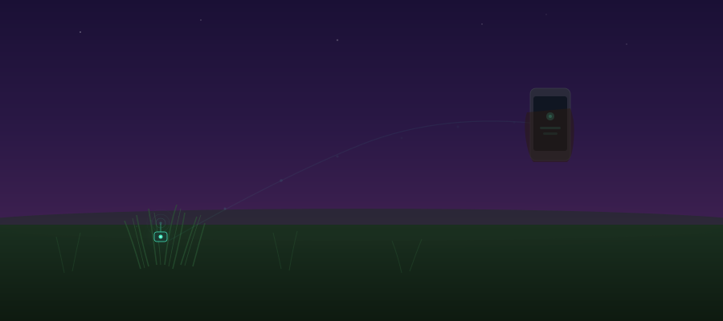
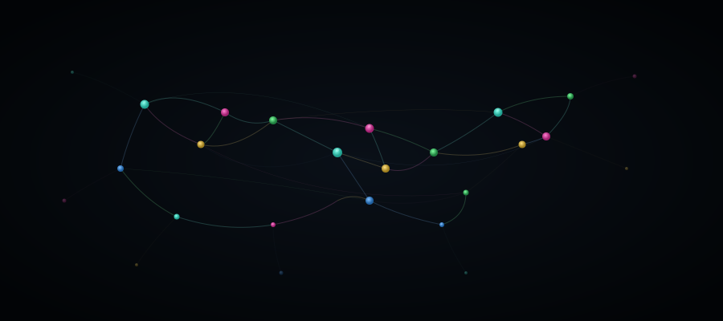

# Indra's Network: Every Node a Mirror

### *Building the internet that an ancient philosophy imagined*

---

<iframe src="images/01-jeweled-net-3d.html" width="100%" height="500" style="border:none; border-radius:8px;" title="The Jeweled Net — an interactive 3D lattice of glowing nodes connected by threads of gold, teal, and blue light against deep space"></iframe>

There is an image in Buddhist and Hindu philosophy called Indra's Net. Picture an infinite lattice stretching in every direction, with a jewel at every intersection. Each jewel is polished so perfectly that it reflects every other jewel in the net. Look into one, and you see all the others. Look into those reflections, and you see the original jewel reflected back.

No center. No beginning or end. No single jewel is more important than any other.

The whole net exists in each point, and each point exists because of the whole. ✦

This is not just a poetic idea. It is a precise description of how a certain kind of network can work. **We are building that network. In Rust.**

The project is called **Indra's Network**, and the name is deliberate. Every peer in this system maintains awareness of its neighbors and propagates that awareness outward, like light bouncing between jewels. There is no central server, no company hosting your connections. The participants do not use the network -- they *are* the network. Groups of any size can form and talk freely. When a message is delivered, confirmation ripples back along the path like light reflecting between jewels. And when one path fails, the network finds another -- because in Indra's Net, there is always another way for light to travel.

But here's the tension: the internet we actually use, the one most of us live inside of every day, bears almost no resemblance to this vision.

---

## 🕸️ What Went Wrong with Connection

The original internet was designed to survive nuclear war. ARPANET, its ancestor, was built so that any node could be destroyed and messages would simply reroute around the gap. Decentralization wasn't a feature -- it was *the point*.

We traded that resilience for convenience. Cloud servers replaced distributed nodes. Platforms replaced protocols. Today, your messages, your communities, your documents, your relationships -- all of it lives on servers owned by a handful of companies. If one of those companies shuts down, your communities vanish. If their data center loses power, you lose access to your own conversations. If they change their terms of service, you comply or you leave -- and "leaving" means abandoning everything you built there.

#### This isn't only a privacy problem. It's a problem of *fragility* and *dependence*.

Consider how strange this is: imagine if the postal service required every letter in the world to pass through a single building in San Francisco. If that building loses power, nobody on earth can send mail. That arrangement would be absurd for physical mail. But it's roughly how most digital communication works today.

The fragility becomes visceral in crisis. Natural disasters knock out cell towers. Infrastructure failures cascade. Governments restrict access. In exactly the moments when communication matters most, centralized systems are most likely to fail. We built the most sophisticated communication technology in history, and anchored it to single points of failure.

---

## 💎 Peers, Not Clients

Indra's Network starts from a different premise: **every device is both sender and receiver.** There is no central server that everything depends on. Some nodes may take on dedicated roles -- backup, pinning, always-on relay -- but they participate in the same mesh as everyone else. No device is privileged. Your phone, your laptop, your colleague's tablet -- each one is a full participant in the network, capable of sending, receiving, holding, and relaying messages.

Here's how it works, told through a story.

---

##### ✉️ THE RELAY

Zara wants to send a message to Isla. But Isla's phone is off -- she's on a flight, or in a dead zone, or just asleep. In a conventional system, this message would go to a server and wait. In Indra's Network, there is no server. So what happens?

Zara's device looks at the network and finds two mutual peers -- Ren and Suki -- who are both connected to Isla. Zara fires **two sealed copies** of the message, one to each. The messages are encrypted end-to-end: Ren and Suki are each holding a locked envelope. Neither has the key. Nobody does except Isla.

Then Zara goes offline. Moments later, Ren goes offline too. Now only Suki is left holding the message, waiting in the dark.

Isla comes online. Suki sees this and delivers the sealed message. Isla opens it, reads it, and her device sends read receipts back toward Zara -- one to Suki, one to Ren. Suki receives her receipt and **purges her copy** of the sealed message. But Ren is still offline. His receipt is **lost**.

Ren comes back online and checks in with Isla. Isla resends the delayed receipt. Ren receives it and **purges his copy** too. No relay node holds the message any longer than it needs to.

Suki and Isla go offline. Zara comes back online and reaches out to Ren. Ren relays the read receipt back to Zara. *Delivered. Confirmed.* The chain is complete -- not because everything went smoothly, but because the network **kept trying**.

---

This is **store-and-forward routing** -- the postal service, the pony express, human message-passing as it has worked for millennia. We taught computers to do what village neighbors have always done: hold a letter for a friend.

The routing algorithm follows a four-step decision tree:

> 1. **Is the person here and online?** → Hand it to them directly
> 2. **Are they offline but usually connected to us?** → Hold it for them
> 3. **Can't reach them at all?** → Find a mutual friend to relay through
> 4. **Nobody can reach them?** → The message waits -- up to seven days, trying and trying

Each node that holds a message is a jewel reflecting light onward. The delivery confirmation traveling back is light bouncing between jewels, retracing the path, completing the circuit.

*A small village where everyone knows everyone. You hand a sealed letter to a mutual friend. No post office needed.* 🏘️

---

## 🔥 The Network That Never Gives Up

Real networks are messy. Connections drop, signals fade, devices move in and out of range. A network that assumes reliable connectivity is a network that fails in the real world. Indra's Network is built for the real world.

The system is **delay-tolerant** -- it adapts its strategy to conditions on the ground:

| Conditions | Strategy | How it works |
|---|---|---|
| 🟢 Good connectivity | **Store-and-forward** | Send one copy directly. Efficient, clean. |
| 🟡 Spotty conditions | **Spray-and-wait** | Send limited copies via different routes, then wait. |
| 🔴 Extreme disconnection | **Epidemic routing** | Flood the network. Maximize delivery at all costs. |

Think of it like spreading news through a village. In a tight-knit neighborhood where you see everyone daily, tell one person and word gets around. In a spread-out rural area, tell several people heading in different directions. In an emergency, tell *everyone you see*.

Messages carry configurable lifetimes. Nodes accept explicit custody -- they don't just passively hold data; they take responsibility for delivery. Your message keeps trying because the network keeps trying. Every jewel in the net holds the light until it can pass it on.

---

### 🔒 Sealed Packets

Here is the part people care about most, and rightly so:

#### The nodes that relay your messages **cannot read them**.

This isn't a policy decision. It isn't a promise from a company. It is mathematics.

Messages are encrypted end-to-end using ChaCha20-Poly1305 authenticated encryption. The relay node holds ciphertext -- meaningless bytes without the recipient's key. No amount of cooperation, coercion, or curiosity lets an intermediate node read what it carries.

And the system has already gone further. Indra's Network integrates **post-quantum cryptography** -- specifically ML-KEM-768, the NIST standard for quantum-resistant key encapsulation, and ML-DSA-65 for digital signatures. This means the key exchange that protects your messages is designed to resist attacks from quantum computers.

> 🛡️ *Protected from computers that don't exist yet.*

Cryptographic agility is easier to build in from the start than to retrofit after the fact.

---

### 🔄 Editing the Same Thing at the Same Time

A sealed message between two people is one thing. But what about shared data -- a document, a membership list, a set of group settings -- edited simultaneously by multiple people on different devices, some of whom might be offline?

##### The grocery list test 🛒

> Imagine a shared grocery list. You add "milk" on your phone while your partner adds "eggs" on theirs. You're both offline. When you reconnect, both edits merge automatically -- no conflicts, no "which version do you want to keep?" dialogs.

Indra's Network makes this work everywhere. Any shared document in the network can be edited by multiple people at the same time, even offline, and their changes merge cleanly when they reconnect. The underlying technology guarantees that everyone converges on the same result regardless of the order updates arrive.

The network delivers these updates two ways. When peers are online together, changes spread instantly through word of mouth -- one node tells its neighbors, who tell theirs. When peers are offline, the same updates travel through store-and-forward so nobody misses anything.

**Word of mouth for speed. Store-and-forward for certainty.** The jewels reflect in real-time and remember what they've seen.

---

### 🌱 The Smallest Jewels

The network doesn't only run on phones and laptops. It's built so that even the tiniest devices can participate -- a temperature sensor in a field, a door sensor in a building, a wildlife tracker in a forest. These devices have tiny batteries and almost no memory. So the network speaks to them simply: small messages, low bandwidth, and the ability to wake up, exchange what they need, and go back to sleep.

A sensor with a few kilobytes of RAM is a full participant in the same network as a desktop workstation. **The net doesn't discriminate by capability. It accommodates.**

---

## ✦ What Emerges

Step back from the mechanisms and look at what this transport layer produces.

- 🌐 A network where your connections don't live on someone else's server
- 🤝 Groups that form organically and persist without any company's permission
- 📄 Documents that sync across devices without a cloud provider in the middle
- 🏔️ Communication that survives infrastructure failures
- 🔗 A foundation where the group IS the network -- no intermediary needed

What emerges from this architecture isn't just message delivery. It's a **topology of trust**. Peers hold messages for each other. They confirm delivery. They maintain shared state. They relay without reading. The network isn't an abstraction floating above the participants. The participants are the network. The network is the participants.

#### Each peer is a jewel. Each connection is a thread. The net holds because every node holds for every other.

---

## ⚙️ Why Rust, Why Now

Indra's Network is built in **Rust** -- the same language that powers Firefox, portions of the Linux kernel, and critical infrastructure at AWS, Microsoft, and Cloudflare. This isn't an incidental choice. P2P networks must handle many simultaneous connections, manage cryptographic operations, and run on everything from servers to microcontrollers. Rust provides memory safety without garbage collection and performance without sacrificing reliability. When a relay node is holding sealed messages for dozens of peers while managing gossip subscriptions and CRDT sync, the language itself prevents entire categories of bugs.

The transport layer is built on **Iroh**, a QUIC-based networking framework that handles peer discovery, NAT traversal, and hole-punching -- the gnarly business of getting two devices to talk to each other when both are behind home routers and firewalls. Iroh handles the plumbing so Indra's Network can focus on the architecture.

Everything is generic and modular. The same router logic that runs in a discrete-event simulation with character-based peer identities runs in production with real cryptographic public keys. The same store-and-forward algorithm, the same DTN strategies, the same CRDT sync -- tested in simulation, deployed in production, **identical code**.

> *The most reliable systems programming language, building the most resilient kind of network.*

---

## 🌅 What Comes Next

The transport stack described in this article is **built and working**. Store-and-forward routing. Back-propagation of delivery confirmations. Delay-tolerant networking with epidemic, spray-and-wait, and custody transfer strategies. End-to-end encryption with post-quantum cryptography. CRDT-based document synchronization. Gossip-based peer discovery. IoT support for resource-constrained devices. All of it implemented, tested, and running.

This transport layer is a foundation. What gets built on top -- the communities, the social structures, the alternative economies that become possible when groups can own their own infrastructure -- is the subject of future articles.

#### The vision: infrastructure for communities that own themselves. Connections that are sovereign and resilient. Groups that don't need permission from a platform to exist.

In Indra's Net, every jewel reflects every other. Every node in our network carries a piece of the whole. There is no center to attack, no company to bankrupt, no server to shut down.

### There is only the net itself -- and every point of light within it. ✦

---

*What would you build on a network with no center?* 💬

**Subscribe** for future articles on the social and economic layers built on this foundation.

**Developers:** [Indra's Network is open source →](https://github.com/IndrasNetwork)
